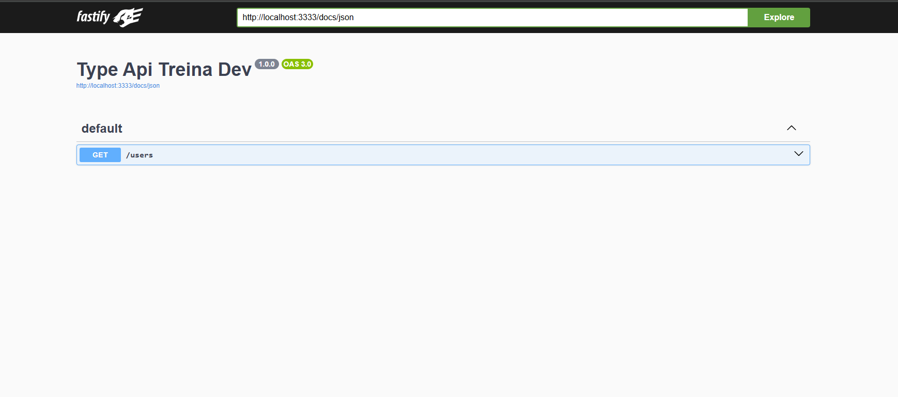
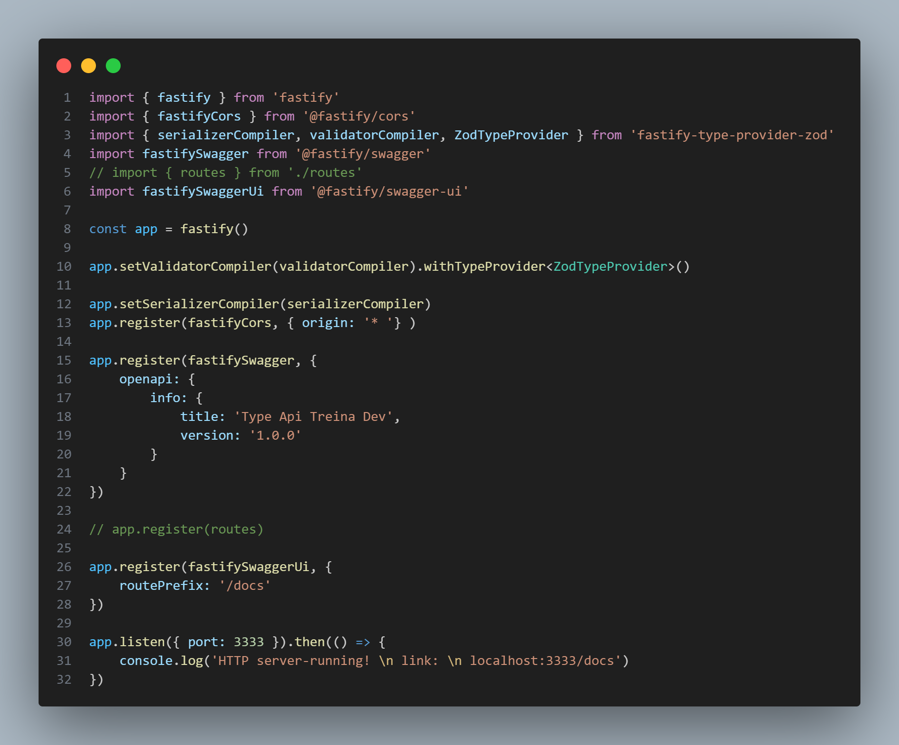

#### Ref.
```
https://www.youtube.com/watch?v=mULWHLquYP0&t=442s
```

 
<br>
<hr>

 

* npm init -y

* npm install fastify fastify-type-provider-zod @fastify/cors zod

* npm install @fastify/swagger @fastify/swagger-ui

* npm i typescript @types/node tsx -D


* tsc --init

* versão do typescript
* tsc -v